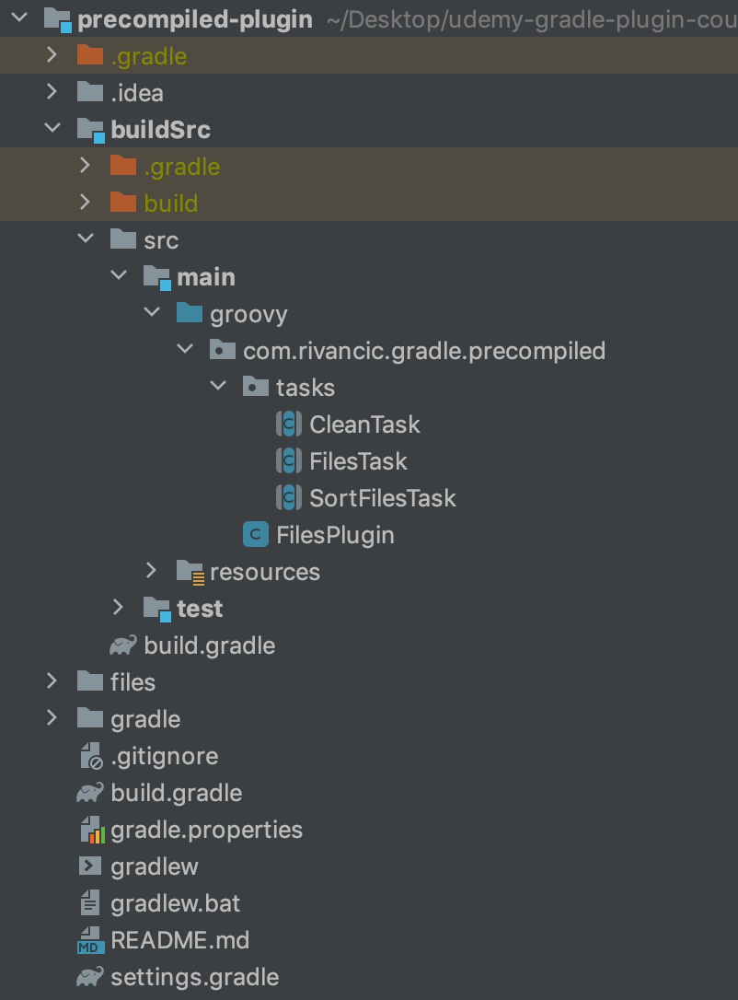

# Precompiled Plugin

In this module you will be able to see why precompiled plugin really offers you to express your build logic in a
more structured way. With writing components of build logic inside standalone classes you will have more a feeling like you are writing
usual Java application than some exotic scripting with DSL language. You could still try to extract tasks in script plugins
but there is no such support as packaging and importing classes from the classpath.

You can also easily debug logic inside your custom classes inside buildScr with IntelliJ IDEA support.

In this project we will builds on top of [previous project](../precompiled-script-plugin) and extract tasks into standalone task classes. Also plugin will not be defined anymore in a groovy script file.
We will create a Groovy class that extends Gradle API Plugin interface.

Build logic is be written in Groovy language.

## Code structure

One of the main benefits of using precompiled plugin instead of script plugins is that you can better [structure build code in buildSrc directory.](https://docs.gradle.org/current/userguide/organizing_gradle_projects.html#sec:build_sources)
You will be able to structure code as in your ordinary JVM code. Code intended to be packaged in the plugin itself should be located under the **main** directory. Inside it packages can be used to structure the code.

  

Tasks and plugins defined in the buildSrc will be available to all the build scripts inside the main project.

Develop custom task.
https://docs.gradle.org/current/userguide/custom_tasks.html

## Components of the build script plugin

- Project
  Applying module that is compiled in buildSrc and made available for all the projects 
- buildSrc
  Containing source code for the Gradle plugin. It's picked up automatically by Gradle. Content of the buildSrc is the same as of any other Java based project.
  Source code in src/main/[groovy/java/kotlin]
  Plugin is represented by the class extending the Plugin interface
  src/main/resources contains META-INF.gradle-plugins/{pluginName}.properties file that specifies short version of the plugin name.
  Content will be compiled and result persisted in internal build folder.

// TODO show how to specify plugin name instead of using full package name of the class implementing the plugin.
  