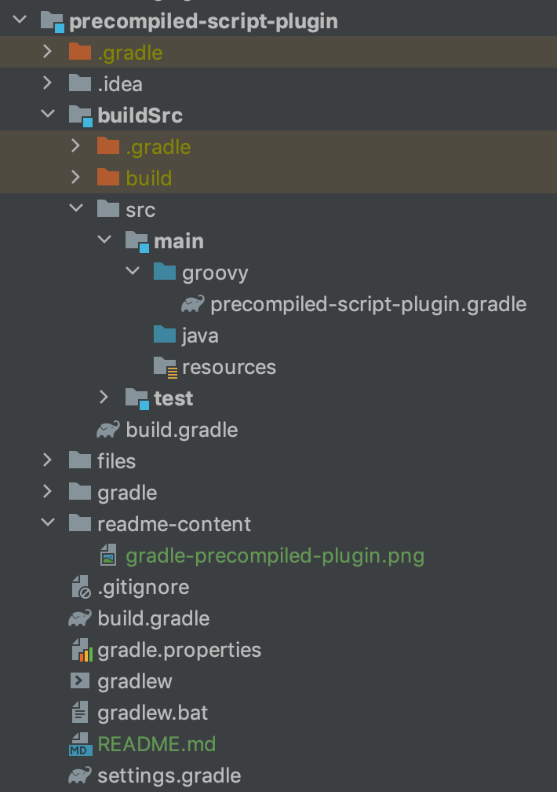

# Precompiled Script Plugin

Till now all the build logic was contained in the build script. Precompiled script plugin allow you to package whole
build script written in DSL language as in Groovy or Kotlin to package it as a plugin from buildSrc directory.
It will be compiled into class files and packaged into a jar. For all intents and purposes, they are binary plugins and 
can be applied by plugin ID, tested and published as binary plugins.

The benefit you will now receive is that you can extract step by step build logic in stand-alone classes inside the 
buildSrc directory or add new logic in same way. This can be an intermediate step to rewriting script logic into 
precompiled or stand-alone binary plugin.

In this project we will builds on top of [previous project](../../script-plugin/simple-script-plugin), it moves build
logic into separate module. Plugin will still be defined in a script file. To create a plugin out of build script under buildSrc we
have to add [groovy-gradle-plugin](https://plugins.gradle.org/plugin/dev.gradleplugins.groovy-gradle-plugin) to buildSrc itself.

## Code structure

Script for the plugin has to be located under buildScr/main/groovy or buildSrc/main/kotlin package.
The name of the plugin by which you will be able to reference it will be the same as the filename of the script itself
without the extension. In case that the filename is **precompiled-script-plugin.gradle** Then the
plugin id will be filename without the extension (.gradle).

- Filename: precompiled-script-plugin.gradle
- Plugin id: precompiled-script-plugin

  

Gradle script defined in buildSrc will be available to all the build scripts inside the main project as a plugin.

## Components of the build script plugin

### Project 
  
Applying plugin that is compiled in buildSrc from the script and made available for all the projects. 

### buildSrc

Containing Gradle script that will be available as a plugin. It's compiled with the help of groovy-gradle-plugin.
Content will be compiled and result persisted in internal build folder.
  