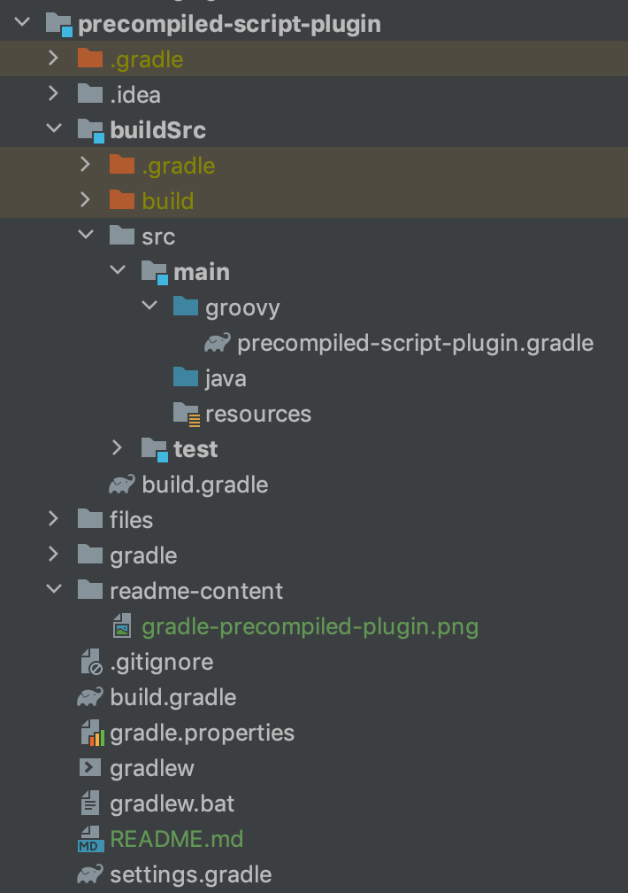

# Precompiled Script Plugin

Till now all the build logic was contained in the script. Precompiled script plugin allows you to package whole
build script written in DSL language as in Groovy or Kotlin, as a binary plugin. Usually this is being done in the **buildSrc** directory.
It will be compiled into class files and packaged into a jar. For all intents and purposes, they are binary plugins and 
can be applied by plugin ID, tested and published as binary plugins.

The benefit you will now receive is that build logic can be extracted step by step in stand-alone classes. 
In the same way new build logic can be added. This can be an intermediate step at rewriting script logic into 
binary plugin.

In this project we will build on top of [previous remote-script-plugin-example](../../script-plugin/remote-script-plugin-example) We will transfer build
logic into separate module. Plugin will still be defined in a script file. To create an actual plugin out of build script under buildSrc we
have to add [groovy-gradle-plugin](https://plugins.gradle.org/plugin/dev.gradleplugins.groovy-gradle-plugin) to buildSrc itself.

## Code structure

Script for the precompiled script plugin is located under `buildScr/main/groovy` or `buildSrc/main/kotlin` package.
The name of the plugin by which you will be able to reference it will be the same as the filename of the script itself
without the extension. In case that the filename is **com.rivancic.files-plugin.gradle** Then the
plugin id will be filename without the extension **.gradle**.

- Filename: com.rivancic.files-plugin.gradle
- Plugin id: com.rivancic.files-plugin

  

Gradle script defined in buildSrc will be available to all the build scripts inside the main project as a plugin.

## Components of the build script plugin

### Project 
  
Project itself is applying plugin that is compiled in `buildSrc` from the script and made available for all the projects. 

### buildSrc

Containing Gradle script that will be compiled as a plugin. This will be done with the help of `groovy-gradle-plugin`.
Content will be compiled and result persisted in internal build folder as a `buildSrc.jar`.

## Resources

[Precompiled Script Plugins (Gradle Userguide)](https://docs.gradle.org/current/userguide/custom_plugins.html#sec:precompiled_plugins)

[buildSrc Directory (Gradle Userguide)](https://docs.gradle.org/current/userguide/organizing_gradle_projects.html#sec:build_sources)

[Convention Plugin (Gradle Samples)](https://docs.gradle.org/current/samples/sample_publishing_convention_plugins.html)
