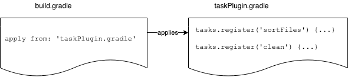

# Local Script Plugin Example

This Gradle project shows how the build logic can be extracted out of main **build.gradle** build script into local script plugin as described in the [following lecture](https://www.udemy.com/course/gradle-development/learn/lecture/27236536#overview).

You would want to apply this kind of refactoring if **build.gradle** script contains more than one group of tasks.
Even better option is to extract logic to **buildSrc** or if the tasks needs to be reused into **external binary plugin**.
Still in case that you are working on a PoC, your project isn't that complex, or you just don't have time to invest into
proper plugin you can extract build logic to local Gradle script files to separate build logic.

This example builds on top of previous project that was used for creating [Gradle tasks](../../task/file-tasks-assignment-done).

Compared to the task assignment all the logic is extracted to [gradle/filesPlugin.gradle](gradle/filesPlugin.gradle) file.
Only thing being done in the main [build.gradle](build.gradle) script file is to apply local script plugin filesPlugin.



## Gradle build script invocation

### Default

By default, always **build.gradle** in the root of the project will be processed by Gradle.

### Specify build file in settings.gradle

You can define [project build filename](https://docs.gradle.org/current/javadoc/org/gradle/api/initialization/ProjectDescriptor.html#setBuildFileName-java.lang.String-) in **settings.gradle** file.

**settings.gradle**
```
rootProject.buildFileName = 'gradle/filesPlugin.gradle'
```

### Specify build file over an CLI option (Deprecated)

To execute taskPlugin script file directly use following command (Will be deprecated in 8.0)

```
./gradlew sF -b gradle/filesPlugin.gradle
```

## Resources

[Script Plugins (Gradle Userguide)](https://docs.gradle.org/current/userguide/plugins.html#sec:script_plugins)

[Gradle CLI - Environment Options (Gradle Userguide)](https://docs.gradle.org/current/userguide/command_line_interface.html#sec:environment_options)

[ProjectDescriptor (Gradle API Documentation)](https://docs.gradle.org/current/javadoc/org/gradle/api/initialization/ProjectDescriptor.html#setBuildFileName-java.lang.String-)

### Examples

Public GitHub examples using local Gradle script plugins:

| Project  | Description |
| ------------- | ------------- |
| **<a href="https://github.com/kurron/open-guide-jvm-builds" target="_blank">kurron/open-guide-jvm-builds</a>** |  Main <a href="https://github.com/kurron/open-guide-jvm-builds/blob/master/build.gradle" target="_blank">gradle.build</a> file uses Gradle scripts inside of <a href="https://github.com/kurron/open-guide-jvm-builds/tree/master/gradle" target="_blank">gradle/</a> directory. There are scripts that set up Spring Boot framework, Spock testing, AWS libraries for cloud computing, Cucumber and many more.  |
| **<a href="https://github.com/mapbox/mapbox-events-android" target="_blank">mapbox/mapbox-events-android</a>** | Example of **mapbox** local script plugin applications. It collects data and location information from the mobile device when using the mapbox service. Main <a href="https://github.com/mapbox/mapbox-events-android/blob/main/build.gradle#L42" target="_blank">build.gradle</a> uses Gradle scripts inside of <a href="https://github.com/mapbox/mapbox-events-android/tree/main/gradle" target="_blank">gradle/</a> directory.<p>You can observe chained references of build:<br/> <a href="https://github.com/mapbox/mapbox-events-android/blob/92b695dabb51be90fcc6d4e5c773e36b066abd22/libcore/build.gradle#L55" target="_blank">scriptsmapbox-events-android/libcore/build.gradle</a> --> <a href="https://github.com/mapbox/mapbox-events-android/blob/92b695dabb51be90fcc6d4e5c773e36b066abd22/gradle/publish.gradle" target="_blank">gradle/publish.gradle</a> --> <a href="https://github.com/mapbox/mapbox-events-android/blob/92b695dabb51be90fcc6d4e5c773e36b066abd22/gradle/artifact-settings.gradle" target="_blank">gradle/artifact-settings.gradle</a></p><p>Reusing one scrip plugin from <a href="https://github.com/mapbox/mapbox-events-android/search?q=dependencies.gradle" target="_blank">multiple scripts</a></p>|
| **<a href="https://github.com/line/armeria" target="_blank">line/armeria</a>** | Microservice framework for multiple protocols application frameworks. Example of a very complex setup for local gradle scripts of **line/ameria** project. Main <a href="https://github.com/line/armeria/blob/master/build.gradle#L25" target="_blank">build.gradle</a> applies only one local Gradle script <a href="https://github.com/line/armeria/blob/master/gradle/scripts/build-flags.gradle" target="_blank">/gradle/scripts/build-flags.gradle</a>, which then does a heavy lifting. |
