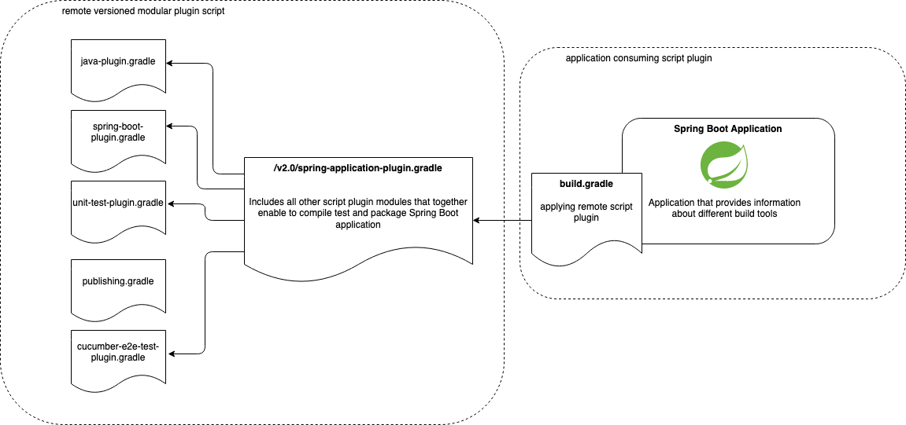
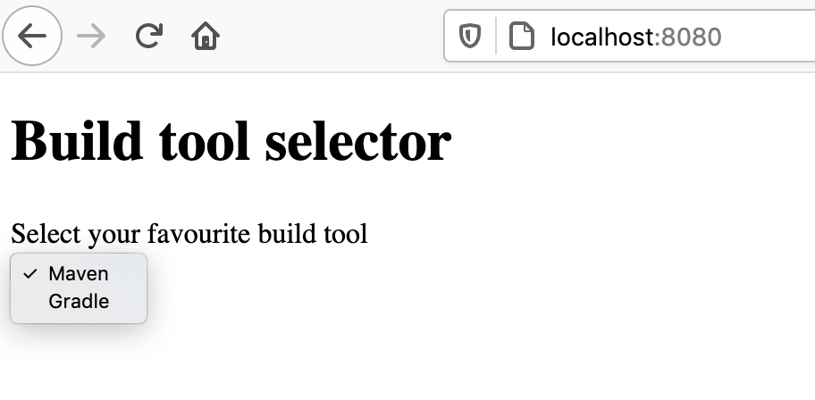
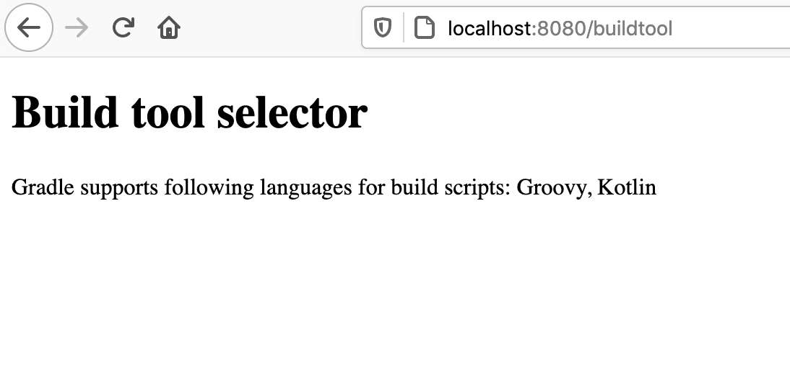

# Gradle Versioned Modular Remote Script Plugin Example

This project contains a Spring Boot application that applies versioned modular remote script plugin.

Applied script plugin contains multiple script plugins itself. It acts like a container for other modular plugins.

To check out plugin source code look at the following repository https://github.com/rivancic/gradle-versioned-modular-script-plugin/tree/main

With applying following plugin in one line 

`apply from: 'https://raw.githubusercontent.com/rivancic/gradle-versioned-modular-script-plugin/v1.0/spring-application-plugin.gradle'`

the build script will have out of the box support for:
- Compiling Java
- Spring Boot application support 
- Unit tests
- Cucumber + Selenium tests

You can execute all those stages with running `gradle build`

In case you use `-i` option at building the project you can see in logs how the script plugins are applied at 
Gradle project configuration phase:

```
Configure project :
...
Cached resource https://raw.githubusercontent.com/rivancic/gradle-versioned-modular-script-plugin/v1.0/spring-application-plugin.gradle
Cached resource https://raw.githubusercontent.com/rivancic/gradle-versioned-modular-script-plugin/v1.0/java-plugin.gradle is up-to-date
Cached resource https://raw.githubusercontent.com/rivancic/gradle-versioned-modular-script-plugin/v1.0/spring-boot-plugin.gradle
Cached resource https://raw.githubusercontent.com/rivancic/gradle-versioned-modular-script-plugin/v1.0/unit-test-plugin.gradle is up-to-date
Cached resource https://raw.githubusercontent.com/rivancic/gradle-versioned-modular-script-plugin/v1.0/cucumber-e2e-test-plugin.gradle  
```

Diagram that show how build.gradle applies remote versioned modular script plugin and how this one includes
other standalone plugins. 
<p width="100%">
  
</p>

## Application functionality

This is a tiny Spring Boot project that uses Thymeleaf as rendering engine.
Unit tests are written in Junit5.
E2E tests are using Cucumber + Selenium.

The application tells you which script languages are supported by different build tools.
When running the application it loads all available build tools and displays them in the list.
After user selects build tool available languages for writing build scripts will be shown.

After application is started it will be available under http://localhost:8080/.

1) One can select build tool 
<p width="100%">
  
</p>

2) Available languages for buildscripts are shown
<p width="100%">
  
</p>

Requirements:
- Application compilation -> Java15
- Executing E2E tests -> Chrome Webdriver path specified under [webdriver.chrome.driver]. Check [application.properties](src/cucumberE2eTest/resources/application.properties)