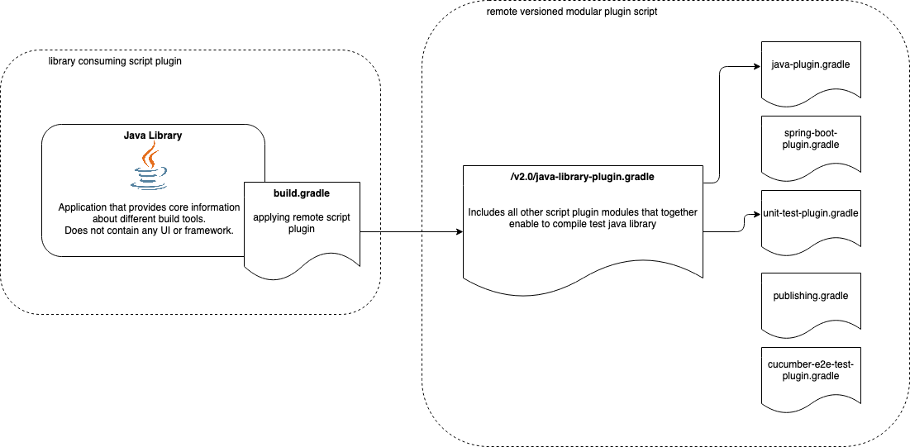

# Gradle Versioned Modular Remote Script Plugin Example

This project contains a Java library that applies versioned modular remote script plugin.

Applied script plugin contains multiple script plugins itself. It acts like a container for other modular plugins.

To check out plugin source code look at the following repository https://github.com/rivancic/gradle-versioned-modular-script-plugin/tree/main

With applying following plugin in one line 

`apply from: 'https://raw.githubusercontent.com/rivancic/gradle-versioned-modular-script-plugin/v1.0/java-library-plugin.gradle'`

the build script will have out of the box support for:
- Compiling Java
- Unit tests

You can execute all those stages with running `gradle build`

In case you use `-i` option at building the project you can see in logs how the script plugins are applied at 
Gradle project configuration phase:

```
Configure project :
...
Cached resource https://raw.githubusercontent.com/rivancic/gradle-versioned-modular-script-plugin/v1.0/java-library-plugin.gradle
Cached resource https://raw.githubusercontent.com/rivancic/gradle-versioned-modular-script-plugin/v1.0/java-plugin.gradle is up-to-date
Cached resource https://raw.githubusercontent.com/rivancic/gradle-versioned-modular-script-plugin/v1.0/unit-test-plugin.gradle is up-to-date 
```

Diagram that show how build.gradle applies remote versioned modular script plugin and how this one includes
other standalone plugins. 
<p width="100%">
  
</p>

## Library functionality

Requirements:
- Library compilation -> Java15