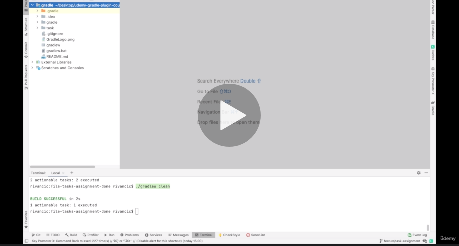
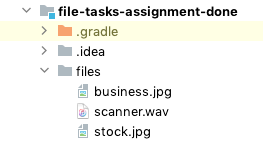
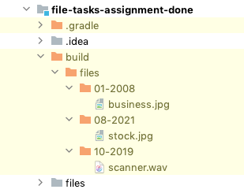
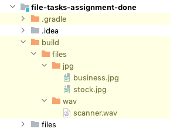

# File Tasks Assignment

Instruction video

<a href="https://www.udemy.com/course/gradle-development/learn/practice/1322992/introduction#overview" target="_blank"></img></a>

## Goal 

The main goal of this assignment is that you revisit your knowledge about task creation and managing files within 
a task action. It's expected that you create two custom Gradle tasks, written in build.gradle script.

Big part of build automation tool like Gradle is to manage source code and generated files. For this reason I would like that
 you get familiar with managing files and directories. 

Remember we always want to keep Gradle tasks neatly organized so users will understand the intention of our tasks and 
will be able to find them quickly next time. We can help users with **grouping** and writing appropriate 
**description** for each of the tasks.

### 1) sortFiles task

* Task with the name **sortFiles** has to sort all the files in the provided directory. 
* Directory relative path is provided in the gradle.properties file under following key: **tasks.files.folder**
* Sorted files have to be moved to **build/files** directory
* You have to support 2 types of sorting:
  * **Creation date** - Files with same creation date month/year will be grouped in the same directory named by creation date month/year
  * **Extension** - Files with same extension are grouped in the directory named by extension
* Sorting algorithm can be specified through **tasks.files.sortType** property with values **extension** or **creationDate**.
* Default sort algorithm is by creationDate
* For example if in the provided directory there is a file named image.jpg, then your build script has to create a 
new jpg directory inside provided build/files and move image.jpg file inside it.

Example of provided unsorted files



After one executes `gradlew sortedFiles` command, every file from the root of provided directory has to be stored in a build/files subfolder by default based on the creation date as in the example below:



If in gradle.properties `tasks.files.sortType=extension` is set then the files should be sorted by extension instead:



### 2) clean task

Simple task that has to remove whole build/files directory.

### Additional requirements

Both tasks have to be grouped under Files tasks and they have to have appropriate description.
If you run `gradlew tasks` above tasks have to be show as follows.

```
rivancic:file-tasks-assignment rivancic$ ./gradlew tasks

> Task :tasks

------------------------------------------------------------
Tasks runnable from root project 'file-tasks-assignment'
------------------------------------------------------------

Build Setup tasks
-----------------
init - Initializes a new Gradle build.
wrapper - Generates Gradle wrapper files.

Files tasks
-----------
sortFiles - Sorts files in given directory into build.files subdirectories based on the sorting type [creationDate,extension]
clean - Clean build directory

Help tasks
----------
buildEnvironment - Displays all buildscript dependencies declared in root project 'file-tasks-assignment'.
dependencies - Displays all dependencies declared in root project 'file-tasks-assignment'.
dependencyInsight - Displays the insight into a specific dependency in root project 'file-tasks-assignment'.
```

## Tips

**General**

- You can use logger instance to print messages that will help you debug script logic.
- Make sure you have IDE properly set up, so you will have autocompletion available, you'll be able to investigate 
source code of Gradle API and debug build.gradle script.
- You can read gradle extra properties from project.ext

**Tasks**

- With the [Task#doLast()](https://docs.gradle.org/current/dsl/org.gradle.api.Task.html#org.gradle.api.Task:doLast(groovy.lang.Closure)) convenience method you can specify Gradle action for the task, that will run when the task will be executed during execution phase.

**Managing Files**

- Method [Project#file()](https://docs.gradle.org/current/dsl/org.gradle.api.Project.html#org.gradle.api.Project:file(java.lang.Object)) gets you relative path to the file from project location.
- Method [Project#mkdir()](https://docs.gradle.org/current/dsl/org.gradle.api.Project.html#org.gradle.api.Project:mkdir(java.lang.Object)) can create new directory [Gradle Creating directories](https://docs.gradle.org/current/userguide/working_with_files.html#sec:creating_directories_example)
- [java.nio.Files.copy()](https://docs.oracle.com/en/java/javase/14/docs/api/java.base/java/nio/file/Files.html#copy(java.nio.file.Path,java.nio.file.Path,java.nio.file.CopyOption...)) can copy file from source to target directory
- You can use all other helper classes from Java [java.io](https://docs.oracle.com/en/java/javase/14/docs/api/java.base/java/io/package-summary.html) and [java.nio.file](https://docs.oracle.com/en/java/javase/14/docs/api/java.base/java/nio/file/package-summary.html) packages to manage files and folders.

